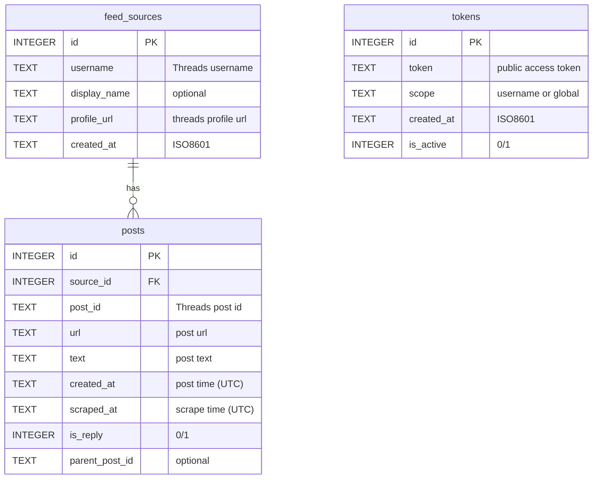

# RSS Storage ERD (SQLite)

## 목적
- 계정별 RSS 피드를 제공하기 위한 저장 구조
- 스크랩 결과를 DB에 저장하고 RSS 요청 시 DB에서 조회
- 추후 큐레이션 기능 확장 가능하도록 설계

## ERD

## 키 설계 이유
- `posts.source_id`는 `feed_sources.id`를 참조하는 FK
  - URL을 FK로 쓰는 대신 안정적인 PK를 사용
  - 실제 post URL은 `posts.url`에 그대로 저장
- `profile_url`은 `feed_sources`에 저장하고 `UNIQUE` 인덱스 후보
  - 계정 URL이 중복 저장되지 않도록 제약 가능

## 인덱스 제안
- `feed_sources.username` UNIQUE
- `feed_sources.profile_url` UNIQUE
- `posts.post_id` UNIQUE
- `posts.source_id` INDEX
- `posts.created_at` INDEX

## RSS 응답 흐름
1. `/v2/rss?username=...&token=...` 요청
2. `tokens` 검증 (is_active, scope)
3. `feed_sources`에서 username 조회
4. `posts`에서 최신 N개 조회 (ORDER BY created_at DESC)
5. RSS XML 생성 후 응답

## 비고
- 저장 제한을 두지 않는 설계
- 장기 저장 시에도 인덱스 중심 조회로 성능 유지
- 큐레이션은 별도 문서 참조
